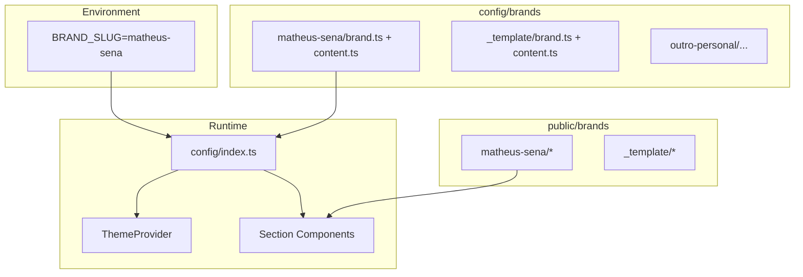
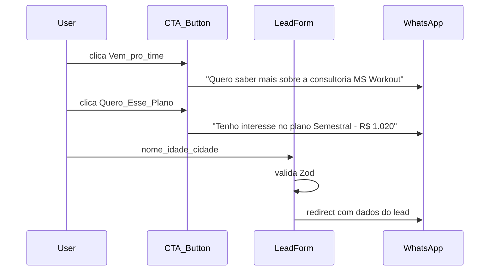
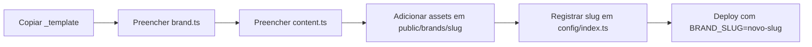

# Plano TLC Spec-Driven — Landing Whitelabel (Cliente âncora: Matheus Sena)

## Escopo e decisões travadas

| Decisão | Escolha |
|---------|---------|
| Metodologia | TLC Spec-Driven (4 fases adaptativas) |
| Stack | Next.js 15 + TypeScript + Tailwind CSS + Framer Motion |
| Variante | **Personal trainer** — consultoria online (sem nutricionista) |
| Cliente âncora | **Matheus Sena — MS Workout** ([`doc-external/ApresentaçãoMatheusSena.pdf`](doc-external/ApresentaçãoMatheusSena.pdf)) |
| Whitelabel | Sistema multi-brand por `slug`; nasce com `matheus-sena`, replicável via template |
| Referência UX | [prtteam.com](https://prtteam.com/) — funil de conversão (adaptado ao modelo MS) |
| Conversão | CTAs diretos para WhatsApp **+** formulário final com redirect |
| Instagram | `@matheussenames` (do material do cliente) |

**Complexidade:** Large — pipeline completo com `.specs/` persistente.

**Princípio dual:**

- **Ship:** landing pronta para o Matheus Sena com copy, planos e estrutura extraídos do PDF.
- **Scale:** outro personal = novo slug em `config/brands/{slug}/` + assets em `public/brands/{slug}/` — zero alteração em componentes.

---

## Cliente âncora — Matheus Sena (MS Workout)

Conteúdo extraído do PDF para seed do preset `matheus-sena`:

### Identidade

| Campo | Valor (PDF) |
|-------|-------------|
| Nome | Matheus Sena |
| Marca | MS Workout |
| Tagline | A mudança de hábito pelo treino |
| Serviço | Consultoria Online |
| Formação | Graduado em Educação Física |
| Experiência | 6+ anos com musculação |
| Prova social | 500+ pessoas ajudadas |
| Instagram | @matheussenames |
| CTA fechamento | "Vem pro time MS Workout!" |

### Objetivos atendidos (público-alvo)

- Hipertrofia
- Performance
- Emagrecimento
- Qualidade de vida

### Modalidades de treino (seção Planejamento)

1. **Treino individualizado** — treino, aeróbico e alongamento conforme rotina, alimentação e horários
2. **Hipertrofia** — ganho de massa magra com técnicas diversas
3. **Emagrecimento** — perda de peso saudável com treino + aeróbicos
4. **Qualidade de vida** — manutenção, movimento, sem foco forçado em emagrecimento

### Diferenciais de suporte

| Diferencial | Descrição |
|-------------|-----------|
| Suporte diário | WhatsApp, resposta em até 24h |
| Correção de execução | Aluno envia vídeo do exercício para feedback |
| Avaliação | Acompanhamento da evolução |

### Como funciona (4 passos)

1. **Anamnese** — questionário após contratar; monta base do treino
2. **Treino individualizado** — plano em até 7 dias + áudio explicativo
3. **Feedbacks** — dúvidas e sensações via WhatsApp a qualquer momento
4. **Novo planejamento** — ao fim da periodização, reavaliação e ajuste

### Resultados / depoimentos (nomes no PDF)

- Lucas Muniz
- Matheus (aluno)
- Haissa

> Imagens reais virão do cliente em `public/brands/matheus-sena/results/`. Até lá, placeholders nomeados por slug.

### Planos e preços

| Plano | Período | Preço | Badge |
|-------|---------|-------|-------|
| Mensal | 1 mês | R$ 200,00 | — |
| Trimestral | 3 meses | R$ 540,00 | 10% OFF |
| Semestral | 6 meses | R$ 1.020,00 | **Recomendado** — 15% OFF |
| Anual | 12 meses | R$ 1.920,00 | 20% OFF (economia R$ 480) |

### Missão (quote de fechamento)

> "Minha missão é atingirmos seus objetivos da maneira mais rápida possível, sempre respeitando sua saúde e de acordo com sua rotina!"

### Pendências do cliente (registrar em STATE.md)

- Número WhatsApp (não consta no PDF — placeholder até confirmação)
- Logo MS Workout, foto profissional, fotos antes/depois (Lucas, Matheus, Haissa)
- Paleta de cores oficial (extrair do logo ou definir com cliente)

---

## Fase 0 — Initialize Project (TLC)

```
.specs/
├── project/
│   ├── PROJECT.md      # visão dual: MS Workout v1 + whitelabel futuro
│   ├── ROADMAP.md
│   └── STATE.md        # pendências Matheus Sena + deferred ideas
└── features/
    ├── whitelabel-config/
    ├── landing-sections/
    └── conversion-whatsapp/
```

Conteúdo de [`.specs/project/PROJECT.md`](.specs/project/PROJECT.md):

- **Vision:** landing de conversão para consultoria online de personal trainer; v1 entrega MS Workout; arquitetura permite clonar para outros profissionais
- **For:** Matheus Sena (v1); futuramente outros personais com mesmo template
- **v1 includes:** preset `matheus-sena` completo, template `_template`, 11 seções alinhadas ao PDF
- **Out of scope:** CMS, backend, pagamentos online, nutricionista, multi-idioma, área logada/app

---

## Arquitetura whitelabel (revisada — multi-brand por slug)



### Resolução de brand

[`config/index.ts`](config/index.ts) exporta `brand` e `content` do slug ativo:

```typescript
// BRAND_SLUG via env; default: "matheus-sena"
import { brand as matheusSenaBrand } from "./brands/matheus-sena/brand";
import { content as matheusSenaContent } from "./brands/matheus-sena/content";

const brands = { "matheus-sena": { brand: matheusSenaBrand, content: matheusSenaContent } };
export const activeBrand = brands[process.env.BRAND_SLUG ?? "matheus-sena"];
```

### Estrutura por brand

```
config/brands/
├── matheus-sena/
│   ├── brand.ts       # cores, logo, whatsapp, imagens, instagram
│   └── content.ts     # todo copy do Matheus (seed do PDF)
└── _template/
    ├── brand.ts       # placeholders documentados
    └── content.ts     # estrutura vazia com comentários guia

public/brands/
├── matheus-sena/
│   ├── logo.svg
│   ├── hero.webp
│   ├── og.png
│   ├── profile.webp
│   ├── results/       # lucas-muniz.webp, matheus.webp, haissa.webp
│   └── testimonials/
└── _template/         # mirrors para onboarding de novo personal
```

**Regra whitelabel:** novo personal = copiar `_template` → `{novo-slug}`, preencher `brand.ts` + `content.ts`, adicionar assets, registrar em `config/index.ts` (ou auto-discovery futuro).

### Contrato `brand.ts`

```typescript
export const brand = {
  slug: "matheus-sena",
  name: "MS Workout",
  professionalName: "Matheus Sena",
  tagline: "A mudança de hábito pelo treino",
  logo: { src: "/brands/matheus-sena/logo.svg", alt: "MS Workout" },
  colors: { primary: string; accent: string; background: string; foreground: string };
  contact: { whatsapp: string }; // E.164 sem +
  social: { instagram: string };
  images: {
    hero: string;
    profile: string;
    og: string;
    results: { id: string; name: string; src: string; alt: string }[];
    testimonials: { id: string; src?: string; alt?: string }[];
  };
};
```

### Contrato `content.ts`

Seções tipadas — componentes consomem `content.{section}`:

`hero`, `about`, `stats`, `trainingTypes`, `support`, `howItWorks`, `comparison`, `results`, `testimonials`, `plans`, `mission`, `form`, `footer`, `nav`

---

## Mapa de seções (PDF + funil prtteam.com)

Ordem do funil adaptada ao material MS Workout:

| # | Seção | Componente | Fonte PDF | Whitelabel keys |
|---|-------|------------|----------|-----------------|
| 1 | Header sticky + CTA | `Header` | CTA "Vem pro time" | `brand.logo`, `content.nav` |
| 2 | Hero | `Hero` | Slide 1 — tagline + consultoria online | `brand.images.hero`, `content.hero` |
| 3 | Quem sou eu | `About` | Slide 2 — bio, formação, 500+ alunos | `brand.images.profile`, `content.about` |
| 4 | Stats autoridade | `AuthorityStats` | 6 anos, 500+ pessoas, Educação Física | `content.stats` |
| 5 | Planejamento | `TrainingTypes` | Slide 3 — 4 modalidades | `content.trainingTypes` |
| 6 | Suporte | `Support` | Slide 4 — WhatsApp 24h, vídeo, avaliação | `content.support` |
| 7 | Como funciona | `HowItWorks` | Slide 5 — 4 passos | `content.howItWorks` |
| 8 | Comparativo | `Comparison` | genérico vs consultoria MS (whitelabel) | `content.comparison` |
| 9 | Resultados | `Results` | Slides 6–8 — Lucas, Matheus, Haissa | `brand.images.results` |
| 10 | Depoimentos | `Testimonials` | complementar aos resultados | `content.testimonials` |
| 11 | Planos | `Pricing` | Slide 9 — 4 planos com preços | `content.plans` |
| 12 | Missão + CTA | `MissionCta` | Slide 10 — quote + "Vem pro time" | `content.mission` |
| 13 | Formulário lead | `LeadForm` | captura antes do WhatsApp | `brand.contact`, `content.form` |
| 14 | Footer | `Footer` | Instagram + copyright | `brand.social`, `content.footer` |

**Mudança vs plano anterior:** `Team` (equipe) substituído por `About` (profissional solo). `BrandPillars` orbitais substituído por `TrainingTypes` (4 modalidades) + `HowItWorks` (4 passos) — mais fiel ao PDF e ao modelo de negócio.

---

## Pilares visuais (seção animada opcional — M3)

Em vez dos 4 pilares genéricos (Treino/Periodização/Estratégia/Mentalidade), usar os **4 objetivos do Matheus** como animação orbital (configurável por brand):

1. Hipertrofia
2. Performance
3. Emagrecimento
4. Qualidade de vida

Outro personal poderá sobrescrever `content.objectives` no seu `content.ts`.

---

## Especificação com IDs rastreáveis (atualizada)

### Feature: `whitelabel-config` (P1)

| ID | Critério WHEN/THEN |
|----|-------------------|
| WL-01 | WHEN dev altera `brand.colors` no slug ativo THEN página SHALL refletir novas cores |
| WL-02 | WHEN dev troca `brand.logo.src` THEN header/footer SHALL exibir novo logo |
| WL-03 | WHEN dev atualiza `brand.images.results` THEN galeria SHALL renderizar novas fotos |
| WL-04 | WHEN dev edita `content.ts` de um slug THEN copy SHALL atualizar sem mudar componentes |
| WL-05 | WHEN `BRAND_SLUG` aponta para outro brand registrado THEN página SHALL carregar config desse slug |
| WL-06 | WHEN dev copia `_template` para novo slug THEN estrutura SHALL estar documentada e funcional com placeholders |
| WL-07 | WHEN `prefers-reduced-motion` THEN animações SHALL ser desabilitadas |

### Feature: `landing-sections` (P1/P2)

| ID | Prioridade | Critério |
|----|------------|----------|
| LAND-01 | P1 | WHEN página carrega THEN header SHALL exibir logo MS Workout + CTA WhatsApp |
| LAND-02 | P1 | WHEN hero renderiza THEN SHALL exibir tagline, consultoria online e CTAs |
| LAND-03 | P1 | WHEN scroll THEN About SHALL exibir bio Matheus Sena com stats |
| LAND-04 | P1 | WHEN scroll THEN TrainingTypes SHALL listar 4 modalidades do PDF |
| LAND-05 | P1 | WHEN scroll THEN HowItWorks SHALL exibir 4 passos (anamnese → novo plano) |
| LAND-06 | P1 | WHEN scroll THEN Pricing SHALL exibir 4 planos com preços R$ 200/540/1020/1920 |
| LAND-07 | P1 | WHEN plano semestral renderiza THEN SHALL exibir badge "Recomendado" |
| LAND-08 | P2 | WHEN scroll THEN Support SHALL exibir 3 diferenciais (WhatsApp, vídeo, avaliação) |
| LAND-09 | P2 | WHEN scroll THEN Results SHALL exibir transformações Lucas/Matheus/Haissa |
| LAND-10 | P2 | WHEN scroll THEN MissionCta SHALL exibir quote + CTA "Vem pro time MS Workout!" |
| LAND-11 | P2 | WHEN scroll THEN Comparison SHALL contrastar consultoria genérica vs método do brand |

### Feature: `conversion-whatsapp` (P1)

| ID | Critério |
|----|----------|
| CONV-01 | WHEN CTA global clicado THEN abre WhatsApp com "Quero saber mais sobre a consultoria MS Workout" |
| CONV-02 | WHEN CTA de plano clicado THEN mensagem inclui nome e preço do plano |
| CONV-03 | WHEN formulário válido enviado THEN redirect WhatsApp com nome, idade e cidade |
| CONV-04 | WHEN campos inválidos THEN erros inline sem redirect |
| CONV-05 | WHEN formulário exibido THEN aviso LGPD configurável abaixo |

---

## ROADMAP — 4 Milestones (revisado)

### M1: Foundation — MS Workout shell

- Scaffold Next.js + `.specs/` com contexto Matheus Sena
- Sistema multi-brand (`config/brands/matheus-sena/` + `_template/`)
- Seed `content.ts` com copy integral do PDF
- `ThemeProvider`, `Header`, `Footer`, placeholders em `public/brands/matheus-sena/`

### M2: MVP Conversão — funil MS operacional

- Hero, About, AuthorityStats, TrainingTypes, Pricing (4 planos reais)
- `lib/whatsapp.ts` + CTAs (header, hero, planos, mission)
- LeadForm com validação
- Responsivo mobile-first

### M3: Confiança — prova social e método

- Support, HowItWorks, Comparison
- Results (galeria Lucas/Matheus/Haissa), Testimonials
- MissionCta, animação objetivos (opcional), smooth scroll

### M4: Polish — deploy + whitelabel docs

- SEO ("Matheus Sena", "MS Workout", "consultoria online")
- Performance Lighthouse
- README: como clonar para novo personal via `_template`
- UAT com conteúdo real do Matheus

---

## Estrutura de código alvo

```
src/
├── app/
│   ├── layout.tsx
│   ├── page.tsx
│   ├── globals.css
│   ├── sitemap.ts
│   └── robots.ts
├── components/
│   ├── ThemeProvider.tsx
│   ├── layout/Header.tsx, Footer.tsx
│   ├── sections/
│   │   ├── Hero.tsx
│   │   ├── About.tsx
│   │   ├── AuthorityStats.tsx
│   │   ├── TrainingTypes.tsx
│   │   ├── Support.tsx
│   │   ├── HowItWorks.tsx
│   │   ├── Comparison.tsx
│   │   ├── Results.tsx
│   │   ├── Testimonials.tsx
│   │   ├── Pricing.tsx
│   │   ├── MissionCta.tsx
│   │   └── LeadForm.tsx
│   └── ui/Button.tsx, Card.tsx, SectionHeading.tsx, Badge.tsx
├── lib/whatsapp.ts, utils.ts
├── config/
│   ├── index.ts
│   └── brands/
│       ├── matheus-sena/brand.ts, content.ts
│       └── _template/brand.ts, content.ts
└── types/index.ts
public/brands/matheus-sena/...
doc-external/ApresentaçãoMatheusSena.pdf   # referência permanente
```

---

## Tasks atômicas (revisadas)

### M1 — Foundation (9 tasks)

| Task | Entregável | Req | Commit |
|------|------------|-----|--------|
| T1 | `.specs/` com PROJECT.md citando MS Workout + pendências cliente | — | `docs: initialize tlc specs for ms-workout landing` |
| T2 | Scaffold Next.js + deps | — | `chore: scaffold next.js app` |
| T3 | `types/` + `config/brands/matheus-sena/` seed do PDF | WL-04 | `feat(config): add matheus-sena brand preset from pdf` |
| T4 | `config/brands/_template/` + `config/index.ts` slug resolver | WL-05, WL-06 | `feat(config): add multi-brand slug resolver and template` |
| T5 | CSS tokens + `ThemeProvider` | WL-01 | `feat(theme): inject brand colors via css variables` |
| T6 | UI primitives | — | `feat(ui): add base components` |
| T7 | `Header` + `Footer` com logo MS + Instagram | LAND-01, WL-02 | `feat(layout): add header and footer` |
| T8 | `page.tsx` shell com 14 seções placeholder | — | `feat(page): compose section shell` |
| T9 | Placeholders `public/brands/matheus-sena/` | WL-03 | `chore(assets): add matheus-sena placeholder assets` |

### M2 — MVP Conversão (8 tasks)

| Task | Entregável | Req | Commit |
|------|------------|-----|--------|
| T10 | `lib/whatsapp.ts` com mensagens MS Workout | CONV-01..03 | `feat(whatsapp): add message builder utility` |
| T11 | `Hero` | LAND-02 | `feat(sections): add hero` |
| T12 | `About` + `AuthorityStats` | LAND-03 | `feat(sections): add about and stats` |
| T13 | `TrainingTypes` | LAND-04 | `feat(sections): add training types` |
| T14 | `Pricing` — 4 planos MS com badge semestral | LAND-06, LAND-07, CONV-02 | `feat(sections): add pricing with ms workout plans` |
| T15 | `LeadForm` + Zod | CONV-03..05 | `feat(sections): add lead form` |
| T16 | `MissionCta` | LAND-10 | `feat(sections): add mission cta` |
| T17 | Responsividade + âncoras nav | LAND-01 | `fix(layout): improve mobile navigation` |

### M3 — Confiança (6 tasks)

| Task | Entregável | Req | Commit |
|------|------------|-----|--------|
| T18 | `HowItWorks` — 4 passos | LAND-05 | `feat(sections): add how it works` |
| T19 | `Support` | LAND-08 | `feat(sections): add support section` |
| T20 | `Comparison` | LAND-11 | `feat(sections): add comparison` |
| T21 | `Results` — Lucas/Matheus/Haissa | LAND-09, WL-03 | `feat(sections): add results gallery` |
| T22 | `Testimonials` | — | `feat(sections): add testimonials` |
| T23 | Smooth scroll + animação objetivos | WL-07 | `feat(ui): add scroll and objectives animation` |

### M4 — Polish (5 tasks)

| Task | Entregável | Req | Commit |
|------|------------|-----|--------|
| T24 | Metadata SEO MS Workout + sitemap + robots | — | `feat(seo): add metadata and sitemap` |
| T25 | `next/image` + `next/font` | — | `perf: optimize images and fonts` |
| T26 | README whitelabel (clonar via `_template`) | WL-06 | `docs: add whitelabel onboarding guide` |
| T27 | Substituir placeholders por assets reais do cliente | WL-02, WL-03 | `chore(assets): add matheus-sena production assets` |
| T28 | Lighthouse + UAT funil completo | — | `perf: improve lighthouse scores` |

---

## Fluxo de conversão (mensagens MS Workout)



---

## Onboarding de novo personal (pós-M4)



Tempo estimado para rebrand: **1–2h** (sem alterar componentes).

---

## Validação (TLC Execute)

1. Página exibe conteúdo fiel ao PDF do Matheus Sena
2. 4 planos com preços e badges corretos
3. Trocar `BRAND_SLUG` (quando segundo brand existir) carrega outro preset
4. Copiar `_template` produz landing funcional com placeholders
5. WhatsApp CTAs + formulário operacionais
6. `npm run build` sem erros

---

## Riscos e mitigações

| Risco | Mitigação |
|-------|-----------|
| Assets reais ainda não disponíveis | Placeholders nomeados; T27 dedicada à troca |
| WhatsApp não está no PDF | Placeholder em `brand.contact.whatsapp` + STATE.md |
| Copy do PDF incompleto para depoimentos | `content.testimonials` com texto configurável; imagens opcionais |
| Confusão brand vs template | `_template` claramente separado; README de onboarding |
| Acoplamento ao Matheus em componentes | Proibir strings hardcoded; lint/review de `content.*` only |

---

## Deferred Ideas (STATE.md)

- Segundo brand real (validar whitelabel end-to-end)
- Auto-discovery de brands em `config/brands/` (sem registrar manualmente)
- Preset nutricionista
- CMS headless
- Analytics
- Testes E2E Playwright
- Domínio customizado msworkout.com.br
